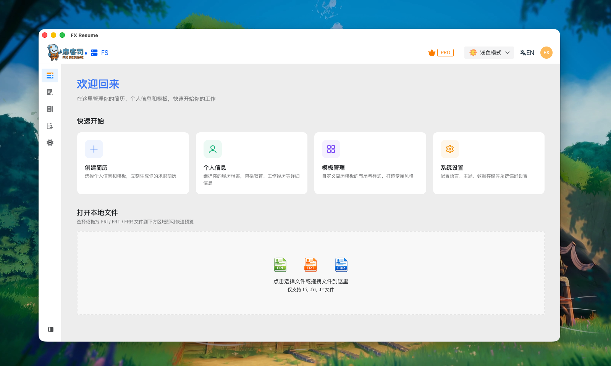
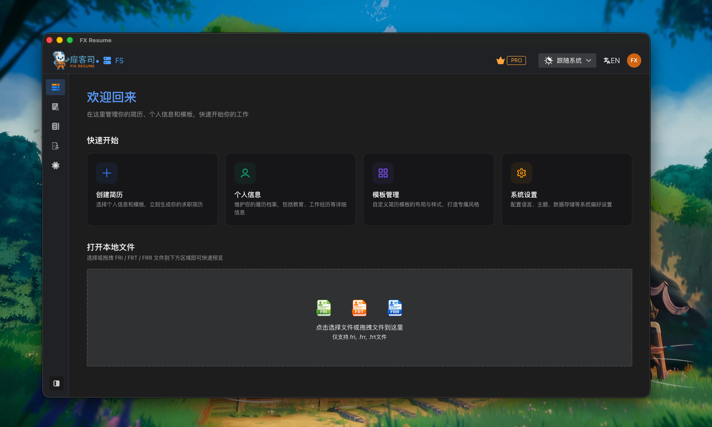

<div align="center">
  
  <h1>扉客司 - Docs</h1>
  <p><strong>简历 = 信息 + 模版</strong> | 你的专属简历管家</p>
  <p>
    <a href="https://fix.my-resume.space">在线版</a> |
    <a href="https://desktop.my-resume.space">桌面版</a> |
    <a href="https://docs.my-resume.space">文档</a>
  </p>
</div>

<div align="center">

[English](README.md) | 简体中文

  
  
</div>

---

这是 [扉客司 (Fix Resume)](https://fix.my-resume.space) 的官方文档与介绍站点。
项目基于 [Rspress](https://rspress.dev/) 搭建，提供了一个极速、现代化且支持中英双语的阅读体验。

## ✨ 核心特性

- **原生双语支持**：内置 `zh`（简体中文）与 `en`（英文）的多语言文档结构。
- **极速构建体验**：底层依靠 Rsbuild 与 Rust 工具链提供飞一般的编译速度。
- **品牌定制主题**：使用与扉客司生态系统一致的主题色与排版。

## 📁 目录结构

```text
docs/
├── en/               # 英文文档目录
│   ├── guide/        # 英文操作指南
│   └── index.md      # 英文站点首页
├── zh/               # 中文文档目录
│   ├── guide/        # 中文操作指南
│   └── index.md      # 中文站点首页
├── public/           # 静态资源（图片、图标等）
styles/               # 全局 CSS 样式及自定义变量
rspress.config.ts     # Rspress 站点配置文件
```

## 🚀 本地开发

我们推荐使用 `pnpm` 来管理项目依赖。

1. **安装依赖**
   ```bash
   pnpm install
   ```

2. **启动开发服务**
   ```bash
   pnpm run dev
   ```
   *本地服务通常会运行在 `http://localhost:3000`。*

3. **生产环境构建**
   ```bash
   pnpm run build
   ```

4. **预览构建产物**
   ```bash
   pnpm run preview
   ```

## 🤝 参与贡献

如果您发现了错别字、解释不清的地方，或者对指南内容有更好的建议，非常欢迎提交 Pull Request。

- 新增的所有文档页面需要同时在 `docs/zh/` 和 `docs/en/` 目录下完成双语撰写。

## 📄 协议

MIT License. 
